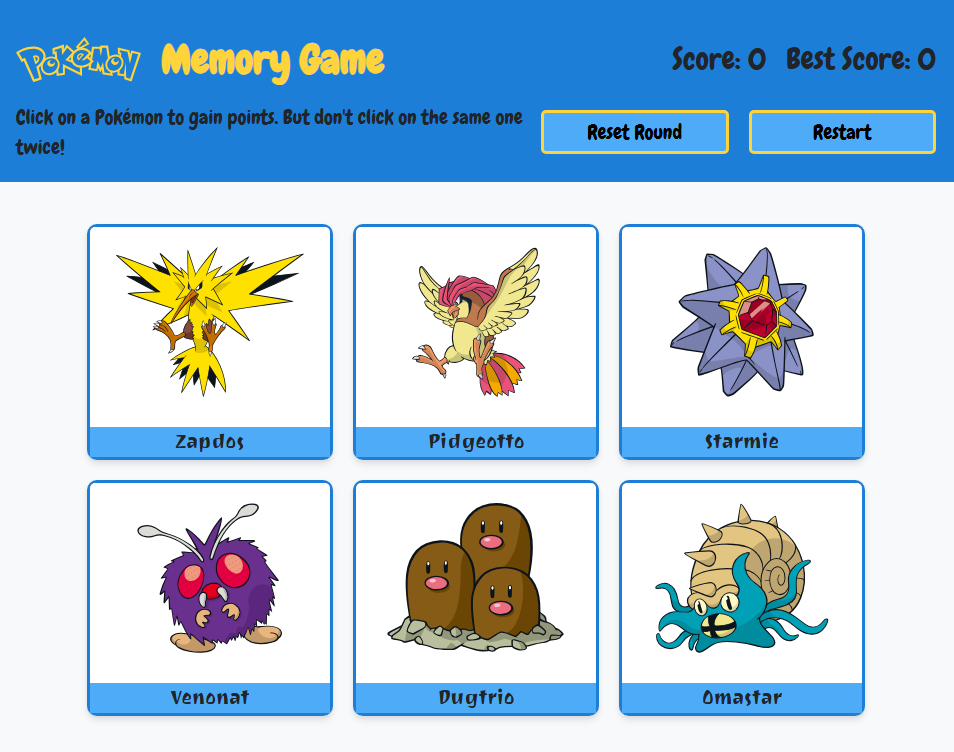

# 🎴 Pokémon Memory Card Game

A Pokémon-themed memory card game built with **React**.  
Test your memory by selecting each Pokémon only once. 
Get them all without repeats for a perfect score.



[▶ Live Demo](https://ljp-pokemon-memory-game.netlify.app/)

---

## ✨ Features
- 🔀 **Randomized cards** every render
- ✅ **Game-over detection** & perfect score check
- 📱 **Fully responsive** — works on mobile, tablet, and desktop
- 🎨 **Minimalist color palette** & clean, modern UI

---

## 🛠 Tech Stack
- **React** (Vite or Create React App)
- **CSS Grid / Flexbox** for layout
- **Vanilla CSS** with CSS variables for theming

---

## 🚀 Getting Started

```bash
# Clone the repository
git clone https://github.com/your-username/pokemon-memory-game.git
cd pokemon-memory-game

# Install dependencies
npm install

# Start development server
npm run dev

# Build for production
npm run build
```

## 🎮 How to Play

1. Click on a card to select it.
2. Don’t click the same card twice — or you lose!
3. Select all cards without repeats to win with a perfect score.
